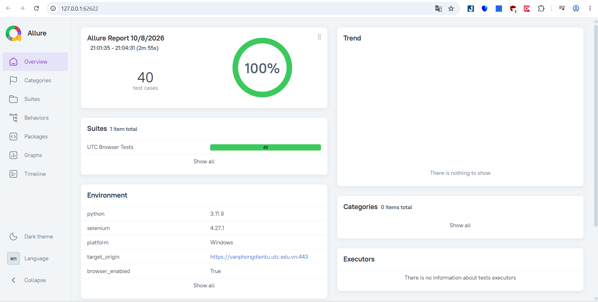

# UTC Office Automated Testing & Security Audit Framework

[](https://github.com/hieud3663/selenium/actions/workflows/browser-tests.yml)
[](https://www.python.org/)
[](https://www.selenium.dev/)
[](https://allurereport.org/)
[](testcases/TestCases_VanPhongDienTu_UTC.xlsx)
[](https://peps.python.org/pep-0008/)

An enterprise-grade, data-driven test automation and security audit framework targeting the authentication subsystem of the **University of Transport and Communications (UTC) Electronic Office** portal ([`vanphongdientu.utc.edu.vn`](https://vanphongdientu.utc.edu.vn/)).

Built with **Python**, **Selenium WebDriver**, **Page Object Model (POM)** architecture, and **Allure Framework**, this project provides a 1:1 mapped 40-testcase test suite covering functional validation, boundary fuzzing, security heuristics (SQLi, XSS, framing protection), network/performance profiling, and UI/accessibility diagnostics.

<p align="center">
  
</p>

---

## Table of Contents

- [Key Features](#key-features)
- [Architecture & Design](#architecture--design)
- [Project Structure](#project-structure)
- [Test Coverage Matrix (40 Test Cases)](#test-coverage-matrix-40-test-cases)
- [Prerequisites](#prerequisites)
- [Installation & Quick Start](#installation--quick-start)
- [Usage & CLI Reference](#usage--cli-reference)
  - [Running the Full Test Suite](#running-the-full-test-suite)
  - [Headless Execution](#headless-execution)
  - [Targeted Test Execution](#targeted-test-execution)
  - [Validating Specifications (`--check`)](#validating-specifications---check)
  - [Running Unit & Regression Tests](#running-unit--regression-tests)
- [Configuration Guide (`config.py`)](#configuration-guide-configpy)
- [Test Reports & Artifacts](#test-reports--artifacts)
  - [Interactive Allure Dashboard](#interactive-allure-dashboard)
  - [Execution Workbook (`results.xlsx`)](#execution-workbook-resultsxlsx)
  - [Sanitized Machine Logs (`results.json`)](#sanitized-machine-logs-resultsjson)
- [Continuous Integration (CI/CD)](#continuous-integration-cicd)
- [Security & Redaction Protocol](#security--redaction-protocol)
- [Scope & Testing Methodology](#scope--testing-methodology)
- [Troubleshooting & FAQ](#troubleshooting--faq)
- [License & References](#license--references)

---

## Key Features

- **Strict Specification-to-Code Mapping**: 40 distinct test scenarios defined in `TestCases_VanPhongDienTu_UTC.xlsx` correspond exactly to 40 parameterized test methods in `test_login.py`.
- **Zero-Privilege Unauthenticated Security Scope**: Specially engineered to evaluate rejection semantics, input sanitization, and defensive headers without requiring privileged accounts, preventing state mutation against live endpoints.
- **High-Performance Single-Session Runner**: Reuses an optimized Chrome browser session across test cases with deterministic state cleanup (cookie/storage purging, viewport restoration, child-tab termination, and network emulation reset).
- **Multi-Format Automated Reporting**: Every run automatically emits:
  - An interactive, standalone Allure 2 HTML dashboard.
  - An Excel report containing both detailed **Execution** logs and a synchronized **Coverage** matrix.
  - Clean, machine-readable JSON summary files.
- **Privacy & Secret Redaction**: Stack traces, error logs, and failure screenshots automatically scrub credentials, tokens, and input fields prior to persistence.
- **Zero External Runtime Dependencies**: Code-driven configuration; requires no `.env` files, Node.js runtime, or npm packages.
- **CI/CD Ready**: Fully automated GitHub Actions workflow on Ubuntu with headless Chrome, cross-Python matrix testing, and artifact archiving.

---

## Architecture & Design

The framework applies industry best practices for robust Web UI and security regression testing:

```
┌─────────────────────────────────────────────────────────────┐
│                       run_tests.py                          │
│               (CLI Entrypoint & Test Runner)                │
└──────────────┬───────────────────────────────┬──────────────┘
               │                               │
       Reads Specs & Validates         Executes Test Suite
               │                               │
               ▼                               ▼
┌──────────────────────────────┐ ┌────────────────────────────┐
│      testcases/reader.py     │ │    tests/test_login.py     │
│  (Excel Specification Reader)│ │    (40 E2E Test Cases)     │
└──────────────┬───────────────┘ └─────────────┬──────────────┘
               │                               │
       Loads Data Driven               Drives Actions via
               │                               │
               ▼                               ▼
┌──────────────────────────────┐ ┌────────────────────────────┐
│ TestCases_VanPhongDienTu_UTC │ │      pages/login_page.py   │
│           (.xlsx)            │ │    (Page Object Model)     │
└──────────────────────────────┘ └─────────────┬──────────────┘
                                               │
                                       Records Results to
                                               │
                                               ▼
                                 ┌────────────────────────────┐
                                 │     reporting/ Module      │
                                 │  - Allure Report Generator │
                                 │  - Excel Execution Matrix  │
                                 │  - JSON Artifact & Redactor│
                                 └────────────────────────────┘
```

1. **Page Object Model (POM)**: Web locators and user interactions are encapsulated within `pages/login_page.py` and `pages/base_page.py`, separating page structure from test logic.
2. **Data-Driven Parameterization**: Individual test inputs (payloads, viewport sizes, boundary lengths, expected rejection tokens) reside as JSON objects inside the Excel specification.
3. **EvidenceResult Collector**: A custom `unittest.TextTestResult` subclass captures timings, screenshots on failure, and redacts sensitive credentials before writing to reports.

---

## Project Structure

```text
selenium/
├── .github/
│   └── workflows/
│       └── browser-tests.yml     # GitHub Actions workflow (Python matrix, headless Chrome, Allure)
├── pages/
│   ├── __init__.py
│   ├── base_page.py              # Base page interactions, explicit waits, DOM observations
│   ├── browser_session.py        # Shared WebDriver lifecycle & state sanitation
│   └── login_page.py             # Form locators, auth flows, security & timing metrics
├── reporting/
│   ├── __init__.py
│   ├── allure_report.py          # Allure CLI wrapper & HTML dashboard generation
│   └── test_result.py            # EvidenceResult collector, Excel & JSON artifact exporter
├── testcases/
│   ├── __init__.py
│   ├── reader.py                 # Workbook reader, schema verification & consistency checks
│   └── TestCases_VanPhongDienTu_UTC.xlsx # Master 40-testcase specification
├── tests/
│   ├── __init__.py
│   ├── test_login.py             # 40 automated browser & security test cases
│   ├── ci_runner.py              # CI orchestration, quality gate, and Actions summary
│   └── unit/                     # Unit test regressions for readers, runners, and reporting
│       ├── test_allure_report.py
│       ├── test_auth_flow.py
│       ├── test_ci.py
│       └── test_project.py
├── config.py                     # Central configuration (URLs, credentials, thresholds)
├── commit.md                     # Incremental 41-commit staging and auditing plan
├── requirements.txt              # Core Python dependencies
├── run_tests.py                  # Primary CLI runner for local and headless execution
└── README.md                     # Documentation
```

> **Note**: Test run outputs are written to `reports/<RUN_ID>/` and are automatically ignored by Git.

---

## Test Coverage Matrix (40 Test Cases)

The suite contains exactly 40 automated test cases categorized into 5 critical quality dimensions:

| ID | Category | Scenario / Objective | Expected Result |
| :--- | :--- | :--- | :--- |
| `TC_FUNC_01` | Functional | Known username paired with incorrect password | Generic credential failure notification displayed |
| `TC_FUNC_02` | Functional | Empty username field submission | Client-side validation prompt or explicit rejection |
| `TC_FUNC_03` | Functional | Empty password field submission | Client-side validation prompt or explicit rejection |
| `TC_FUNC_04` | Functional | Both credentials empty submission | Required field validation triggers; submission aborted |
| `TC_FUNC_05` | Functional | Non-existent username with random password | Generic credential failure notification |
| `TC_FUNC_06` | Functional | Inverted credentials (password in username field) | Rejected; authentication denied |
| `TC_FUNC_07` | Functional | Case sensitivity test for invalid password string | Rejected; case-sensitive hashing enforced |
| `TC_FUNC_08` | Functional | "Remember Me" checked with invalid credentials | Form rejected; session cookie not persisted |
| `TC_FUNC_09` | Functional | "Remember Me" unchecked with invalid credentials | Form rejected cleanly |
| `TC_FUNC_10` | Functional | Form submission via `<Enter>` keyboard key | Form correctly posts and triggers rejection |
| `TC_FUNC_11` | Functional | Direct unauthenticated GET request to login URL | Login controls render cleanly with status 200 |
| `TC_FUNC_12` | Functional | Browser page refresh immediately following failure | Clean form state re-established without residue |
| `TC_BND_01` | Boundary | Non-existent username containing leading/trailing whitespace | Whitespace either trimmed or consistently rejected |
| `TC_BND_02` | Boundary | Invalid username with interior spaces | Consistent rejection without backend crash |
| `TC_BND_03` | Boundary | Username tested at length boundaries (1, 255, 256 chars) | Handled gracefully within input buffer constraints |
| `TC_BND_04` | Boundary | Password tested at length boundaries (1, 255, 256 chars) | Handled gracefully without server-side exception |
| `TC_BND_05` | Boundary | Non-ASCII and Unicode characters in auth inputs | UTF-8 encoded properly; no database/encoding crash |
| `TC_SEC_01` | Security | Password input field masking (`type="password"`) | Password masked on screen; plaintext hidden |
| `TC_SEC_02` | Security | SQL Injection tautology vector in username (`' OR '1'='1`) | Sanitized; generic rejection without SQL error leak |
| `TC_SEC_03` | Security | SQL Injection comment vector in username (`admin'--`) | Sanitized; generic rejection without SQL error leak |
| `TC_SEC_04` | Security | SQL Injection UNION query sample (`' UNION SELECT...`) | Sanitized; generic rejection without SQL error leak |
| `TC_SEC_05` | Security | SQL Injection tautology vector in password field | Sanitized; generic rejection without SQL error leak |
| `TC_SEC_06` | Security | Syntax-breaking quote sequences in username (`'"\`) | Sanitized; no unhandled backend syntax exceptions |
| `TC_SEC_07` | Security | Stored/Reflected XSS `<script>` tag injection | Properly escaped in DOM; no JavaScript execution |
| `TC_SEC_08` | Security | Stored/Reflected XSS `` injection | Event handlers disarmed; no execution in DOM |
| `TC_SEC_09` | Security | Repeated burst submissions (5 consecutive failures) | Consistent rejection; server maintains responsiveness |
| `TC_SEC_10` | Security | Enforced TLS/HTTPS communication | Transport layer encrypted; HTTP redirected or disallowed |
| `TC_SEC_11` | Security | HTTP POST method verification & URL credential leak | Credentials submitted in body, never in URL parameters |
| `TC_SEC_12` | Security | Cross-origin anti-framing baseline observation | Capture `X-Frame-Options` & `CSP frame-ancestors`; inspect cross-origin iframe login rendering and record security findings without asserting policy compliance |
| `TC_PERF_01` | Performance | Page load duration across cold cache samples (≤ 5000ms) | Page loads within configured SLA budget |
| `TC_PERF_02` | Performance | Rejection response turnaround latency | Auth feedback rendered within acceptable delay |
| `TC_PERF_03` | Performance | Time to First Byte (TTFB) cold cache metrics (≤ 3000ms) | Initial server byte received within configured SLA |
| `TC_PERF_04` | Performance | Total network payload transfer size (≤ 3.0 MiB) | Wire transfer remains under bandwidth budget |
| `TC_PERF_05` | Performance | Network request count during login load (≤ 50 requests) | Resource count remains under budget limit |
| `TC_PERF_06` | Performance | Network disconnection handling and recovery | Graceful handling during offline state; recovered on retry |
| `TC_UI_01` | UI / UX | Form controls visibility and interactivity check | Username, password, and submit controls fully enabled |
| `TC_UI_02` | UI / UX | Enter key behavior with password field empty | Form does not bypass validation on keyboard submit |
| `TC_UI_03` | UI / UX | Sequential TAB navigation order through form | TAB focuses controls in sequence: username → password → UTC e-mail login link → login button |
| `TC_UI_04` | UI / UX | Error message styling and visual prominence | Clear and prominent rejection message rendered |
| `TC_UI_05` | UI / UX | Responsive layout verification across 3 viewports | Form functional on Desktop, Tablet, and Mobile sizes |

---

## Prerequisites

Before executing tests, ensure your local environment meets these requirements:

| Component | Minimum Version | Note |
| :--- | :--- | :--- |
| **Python** | `3.10` or `3.12+` | 64-bit recommended |
| **Google Chrome** | Latest Stable | ChromeDriver is managed automatically by Selenium 4 |
| **Java (JRE/JDK)** | `17+` | Required for Allure CLI report generation |
| **Allure CLI** | `2.x` (e.g., `2.46.1`) | Must be available on system `PATH` or configured |

---

## Installation & Quick Start

### 1. Clone the Repository

```bash
git clone https://github.com/hieud3663/selenium.git
cd selenium
```

### 2. Set Up a Python Virtual Environment

**Windows (PowerShell):**
```powershell
python -m venv .venv
.\.venv\Scripts\Activate.ps1
```

**Linux / macOS:**
```bash
python3 -m venv .venv
source .venv/bin/activate
```

### 3. Install Dependencies

```bash
pip install --upgrade pip
pip install -r requirements.txt
```

### 4. Install Allure CLI (Optional for execution, required for HTML reports)

- **Windows (Scoop / Chocolatey):**
  ```powershell
  scoop install allure
  # or
  choco install allure-commandline
  ```
- **macOS (Homebrew):**
  ```bash
  brew install allure
  ```
- **Linux:** Download the standalone tarball from [Allure Releases](https://github.com/allure-framework/allure2/releases) and add `bin/` to your `$PATH`.

---

## Usage & CLI Reference

All execution workflows are managed through the central CLI runner: [`run_tests.py`](file:///d:/KiemThuPhanMem/selenium/run_tests.py).

### Running the Full Test Suite

Runs all 40 test cases using a visible Chrome browser instance and automatically generates the Allure HTML report upon completion:

```powershell
# Windows
$env:PYTHONUTF8="1"
.\.venv\Scripts\python.exe run_tests.py

# Linux / macOS
PYTHONUTF8=1 python run_tests.py
```

### Headless Execution

To run Chrome without opening a GUI window (ideal for CI servers or background runs):

```powershell
.\.venv\Scripts\python.exe run_tests.py --headless
```

### Targeted Test Execution

Execute one or more specific test cases by their identifier:

```powershell
# Run a single boundary test:
.\.venv\Scripts\python.exe run_tests.py --test TC_BND_01

# Run multiple specific test cases:
.\.venv\Scripts\python.exe run_tests.py --test TC_FUNC_02 --test TC_SEC_07 --test TC_UI_05
```

### Validating Specifications (`--check`)

Verifies the integrity of `TestCases_VanPhongDienTu_UTC.xlsx` against the test methods in `tests/test_login.py` without launching a browser:

```powershell
.\.venv\Scripts\python.exe run_tests.py --check
```

### Running Unit & Regression Tests

Run the standalone unit test suite validating the Excel reader, evidence collector, and reporting engines:

```powershell
.\.venv\Scripts\python.exe -m unittest discover -s tests/unit -v
```

---

## Configuration Guide (`config.py`)

All global parameters and environmental settings are centralized in [`config.py`](file:///d:/KiemThuPhanMem/selenium/config.py):

```python
@dataclass(frozen=True)
class Settings:
    url: str = "https://vanphongdientu.utc.edu.vn/"
    timeout: float = 10                  # Explicit wait timeout in seconds
    run_browser: bool = True             # Enable browser execution
    run_security: bool = True            # Include security test cases in runs
    headless: bool = False               # Run Chrome in headless mode by default

    # Test accounts & negative data samples
    username: str = "huongnt"
    password: str = "123456@utc"
    invalid_password: str = "wrong_password_123"
    nonexistent_username: str = "nonexistent_user_9999"

    # DOM selectors & expected verification tokens
    success_selector: str = ".user-info, .profile, .fullname, .header-user, #user"
    success_text: str = "huongnt"
    error_selector: str = "div.error"
    error_text: str = "Tài khoản hoặc mật khẩu không đúng."
    remember_selector: str = "#persistent"

    # SLA performance thresholds
    username_trim: str = "reject"        # "accept" or "reject"
    page_load_limit_ms: float | None = 5000.0  # Cold-cache page load ceiling
    ttfb_limit_ms: float | None = 3000.0       # Time to first byte ceiling
    allure_command: str = "allure"             # Name or absolute path to Allure CLI
```

---

## Test Reports & Artifacts

After every execution, a uniquely timestamped directory is created under `reports/<RUN_ID>/`:

```text
reports/20261008T132849Z-4a2f8b1c/
├── results.json           # Machine-readable run outcome and environmental metadata
├── results.xlsx           # Excel workbook containing Execution and Coverage sheets
├── ci-summary.md          # Generated markdown summary (in CI environments)
├── allure-results/        # Raw Allure event files, attachments, and screenshots
│   ├── *-result.json
│   ├── *-attachment.png
│   └── environment.properties
└── allure-report/         # Standalone generated HTML Allure dashboard
    └── index.html
```

### Interactive Allure Dashboard


To open and browse the most recently generated HTML report via Allure's embedded web server:

```powershell
# Open the latest run report:
.\.venv\Scripts\python.exe run_tests.py --open-report

# Open a specific historical run:
.\.venv\Scripts\python.exe run_tests.py --open-report 20261008T132849Z-4a2f8b1c
```

> **Note**: Because Allure HTML reports require local web-server delivery for AJAX assets, do not open `index.html` via `file://`. Use `--open-report` instead. Press `Ctrl+C` in your terminal when finished viewing.

### Execution Workbook (`results.xlsx`)

The test harness preserves the original specification and generates an independent evaluation workbook containing:
- **Execution Sheet**: Logs each executed test's start timestamp, duration, status (`PASS`, `PARTIAL_PASS`, `FAIL`, `ERROR`), and failure reason.
- **Coverage Sheet**: Maps all 40 test cases to their automation methods and parameter definitions.

### Sanitized Machine Logs (`results.json`)

Contains execution metadata, platform architecture, Selenium version, and exact outcome counts for programmatic CI gates.

---

## Continuous Integration (CI/CD)

The repository includes a battle-tested GitHub Actions workflow at [`.github/workflows/browser-tests.yml`](file:///d:/KiemThuPhanMem/selenium/.github/workflows/browser-tests.yml):

- **Matrix Validation**: Validates Excel specifications and executes unit tests across Python `3.10` and `3.12`.
- **Headless Chrome**: Runs the browser suite on Ubuntu without opening a graphical display. The Actions summary identifies the browser as headless.
- **Security observations**: Findings such as a missing anti-framing policy are shown as non-blocking observations until an approved website requirement is supplied. The CI summary still calls them out explicitly.
- **Concurrency Locks**: Limits concurrent execution via `concurrency.group: utc-login-browser` to avoid overloading the test server.
- **Artifact Archival**: Preserves test reports, logs, and screenshots for 14 days, even when test cases fail.

To run the CI gate locally:

```powershell
python -m tests.ci_runner --headless
```

---

## Security & Redaction Protocol

This framework follows strict data protection and responsible disclosure standards:

1. **Credential Redaction**: Passwords, usernames, and secret parameters are systematically sanitized via regex scrubbers before writing to logs, Allure attachments, or stack traces.
2. **Failure Screenshot Privacy**: If a test fails, the input fields are cleared from the DOM before capturing failure evidence screenshots, preventing plain-text password leakage.
3. **Traceback Scrubbing**: Unhandled exception traces are stripped of raw parameters and credentials before serializing to disk.

---

## Scope & Testing Methodology

- **Non-Destructive Testing**: All test payloads (SQL injection samples, boundary strings, XSS probes) are passive and non-destructive. They are designed to confirm input validation and rejection handling without degrading service stability.
- **Baseline Security Observations**: Scenarios like `TC_SEC_12` operate as automated baseline observations rather than strict pass/fail policy gates. The runner captures anti-framing headers (`X-Frame-Options`, `Content-Security-Policy: frame-ancestors`) and detects whether the login form renders inside a cross-origin iframe, recording structured findings (e.g., `login_form_rendered_in_cross_origin_iframe`) for administrator review without asserting institutional compliance.
- **SLA & Budget Boundaries**: Performance budgets (such as 5000ms page load or 50 HTTP requests) are baseline test criteria specified within the test plan and do not constitute formal service-level agreements guaranteed by UTC.
- **Verdict Semantics**:
  - `PASS`: The tested scenario behaved strictly in accordance with the documented expected behavior.
  - `PARTIAL_PASS`: The core automated assertions succeeded while dependent secondary criteria remain to be validated manually.
  - `FAIL`: The observed application behavior contradicted the expected test assertion.
  - `ERROR`: An environmental or configuration anomaly interrupted test execution.

---

## Troubleshooting & FAQ

### 1. `UnicodeEncodeError: 'charmap' codec can't encode character...`
**Resolution:** On Windows systems, configure Python to use UTF-8 encoding for standard I/O streams:
```powershell
$env:PYTHONUTF8 = "1"
```

### 2. Allure CLI is not recognized (`'allure' is not recognized as an internal or external command`)
**Resolution:** Ensure Allure is installed and added to your system `PATH`. Alternatively, specify the absolute path to `allure.bat` directly in `config.py`:
```python
allure_command: str = r"C:\Tools\allure-2.46.1\bin\allure.bat"
```

### 3. Selenium WebDriver Version Mismatch
**Resolution:** Selenium 4.15+ utilizes **Selenium Manager** to automatically download and manage matching ChromeDriver binaries. Ensure your network permits outbound access to Google APIs, or pre-install a matching ChromeDriver binary on your `PATH`.

---

## License & References

This project is developed for educational, academic quality assurance, and automated verification purposes.

- [Selenium WebDriver Documentation](https://www.selenium.dev/documentation/)
- [Page Object Model Best Practices](https://www.selenium.dev/documentation/test_practices/encouraged/page_object_models/)
- [Allure Framework Documentation](https://allurereport.org/docs/)
- [OWASP Web Security Testing Guide (WSTG v4.2)](https://wstg.owasp.org/v4.2/4-Web_Application_Security_Testing/)
- [Python unittest Standard Library](https://docs.python.org/3/library/unittest.html)
